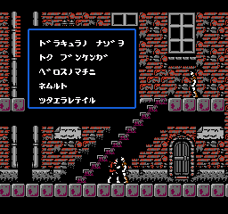

# 悪魔城ドラキュラII 呪いの封印 retranslation 日本語版に対するパッチ
以下ページで配布されているハックロムに対するパッチ。NES版ドラキュラIIにマップ機能、デモ、セーブ機能など追加されている。

https://bisqwit.iki.fi/cv2fin/#use

## 元ファイル
- cv2jap-2_12_1_1-ntsc-stm1mwfmFruSp0.ipsのパッチを適用したもの。
	- 日本語, v2.12.1.1, NTSC, MMC1, あとはデフォルトで生成された
- オリジナルROM CRC32: A9C2C503
	- NES Classic Editionより入手
- 上記パッチを当てたROM CRC32: 26C260C0

# ドラ2_retrans_jp_MMC1_オセ.bps
- タイトルスクリーンの"スタートをツイテ"を"スタートをオセ"に変更するパッチ
- 他のオプションで生成したROMの場合、
	- 6B 0A 0B 08 0C 19 12 13 14 FE を探して
	- 6C 0A 0B 08 0C 19 16 17 FE FE で上書きすればよい

# ドラ2_retrans_jp_MMC1_オセ_ひらがな.bps
- ひらがなにするパッチ
- 他バージョン、ＦＤＳ版で同じことをするならmove_font.abpを参考にするとよい。

