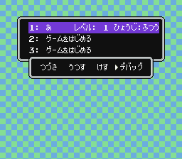
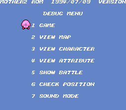
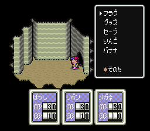
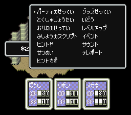

# MOTHER2
以下ページで配布されているハックロムに対するパッチ。NES版ドラキュラIIにマップ機能、デモ、セーブ機能など追加されている。

https://bisqwit.iki.fi/cv2fin/#use

## 元ファイル
- MOTHER2(日本語版)
- 3MB (trim)
- CRC32: 2019FABE

# デバッグメニューパッチ
## MOTHER-2_DEBUG_trim.bps
- ファイル選択画面の"せってい"が"デバッグ"に変化している
- いわゆるBoot-up Debug Menuが開く。



- memo: ネスが移動できるようになった瞬間セーブされている

## MOTHER-2_GAME_START_trim.bps
- ファイルを選択したら問答無用でデバッグメニューが開く。

## 注意
- VIEW MAP等で行った先のマップから一度も移動せずYやBボタンでメニューを開いて閉じるとフリーズする

## メモ
```
VIEW MAP操作
Aボタン：VIEW MAP操作に戻る
Bボタン：コマンドメニュー
Yボタン：デバッグメニュー
　「りんご」からTASでよくみるデバッグ画面が出る
SELECT+START：Boot-Up Debug Menuへ戻る

VIEW ATTRIBUTE操作
SELECTボタン：表示情報変更？
マップ移動すると透過表示されなくなる
```





